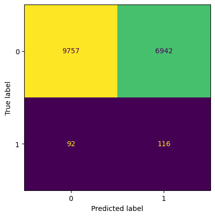

# Starbucks_case_study_Udacity_Data_Science
Case study from UDACITY Data Scientist Nanodegree

# Context

This case study is part of UDACITY [DATA SCIENTIST]() Nanodegree. It deals with a Starbucks promotion activity to increase Sales.The dataset contains control and experiment groups data capture (85.000 customer records). For each customer, a total of 7 unknown features are also provided.

# Objective

The task is to analyse whether the promotion activity is a success. 2 metrics will be evaluated:
- Increase in purchase rate (IRR)
- Value of incremental revenues net of promotion costs (NIR) - This metric is particularly important to judge the practical significance of the experiment.

Detailed instructions are provided in the notebook.

# Datasets

2 datasets are provided. A train set to perform our hypothesis testing and a test set to measure our promotion strategy performance vs a benchmark.

# Project structure

We first perform hypothesis testing on the invariant variable and then the 2 evaluation metrics.

Our analysis shows that, while the promotion has a statistical effect on the purchase rate (vs control group), it does not generate extra revenues: the incremental sales are marginal and more than compensated by the promotion costs. As such the promotion should not be repeated.

We then train a Classification model using the provided features to predict whether the customer will purchase the promotion or not. Using this model, we fine-tune our promotion strategy to target this customer segment (based on classification model purchase prediction). Using this strategy, we end up outperforming the benchmark using a random forest model on the unseen test set.

Confusion Matrix from Random Forest Model on 20% of the train set reserved for validation:

The ultimate objective of the promotion strategy is to :
- reduce false negatives so that to send the promotion to all customers willing to buy the promotion
- reduce false positive so that to minimize promotion costs

A special attention is given to the highly imbalanced dataset (very few purchase class).
